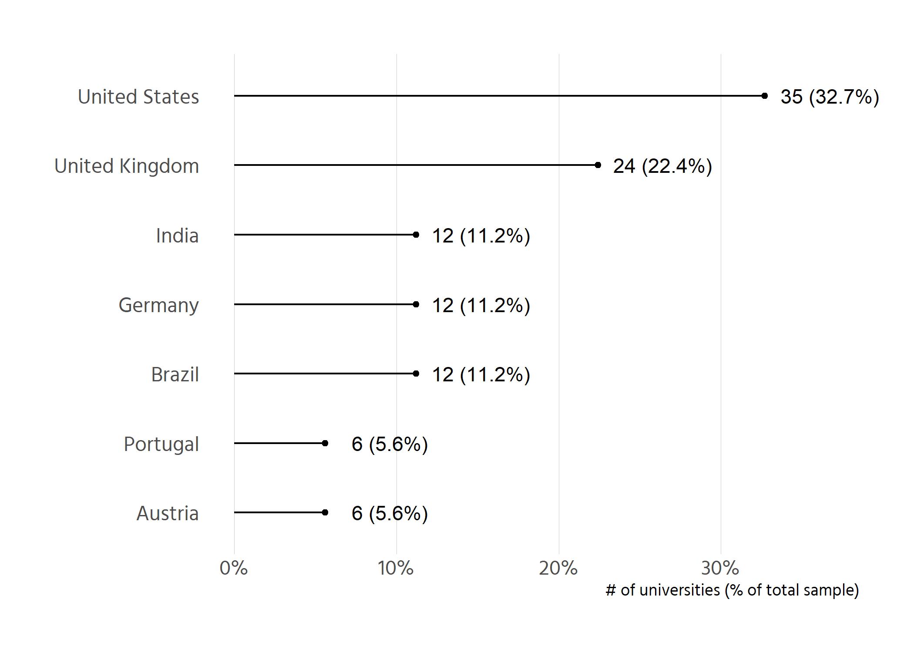
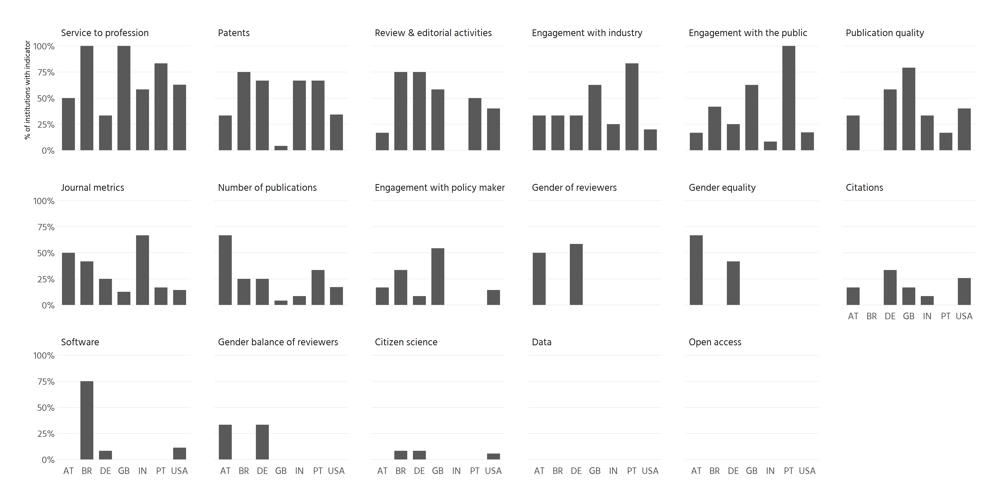
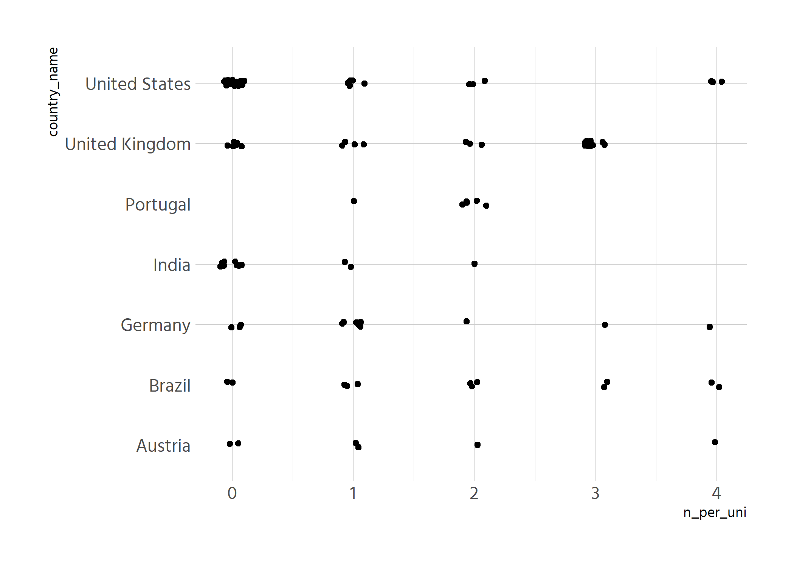

# Data preparation
The data files were merged and restructured:

- if a given university has several policies, the recoded set only records 
whether any of the policies had a match to an indicator. E.g. if a university 
has three policies and in one an indicator was coded, the indicator is found for
the whole university. This is the same result as if all three policies had
a match on the indicator.

Does this make sense? We could try to compare different types of policies by
taking the metadata from our data collection.

# Sampling methods
Include table of how we determined the number of universities to sample per 
country.

# Sample overview
<!-- -->


# Indicators by country


<!-- -->

Alternative variant of tile plot
<!-- -->


# Further tile plot according to ranking position


<!-- -->

# Indicators overall
<!-- -->


Number of criteria per country

|country        | n_unis| n_criteria| criteria_found|proportion_of_all_criteria |
|:--------------|------:|----------:|--------------:|:--------------------------|
|Austria        |      6|         17|             29|28%                        |
|Brazil         |     12|         17|             61|30%                        |
|Germany        |     12|         17|             64|31%                        |
|United Kingdom |     24|         17|            109|27%                        |
|India          |     12|         17|             33|16%                        |
|Portugal       |      6|         17|             27|26%                        |
|United States  |     35|         17|            106|18%                        |


<!-- -->

Problem with the above figure: only 6 data points per Y-Val (code), therefore
boxplot might obscure this. Maybe should show this. Maybe also just to vertical
bars for each country.


<!-- -->


```{=html}
<div id="htmlwidget-1e97256996af5abcad4c" style="width:1050px;height:750px;" class="plotly html-widget"></div>
<script type="application/json" data-for="htmlwidget-1e97256996af5abcad4c">{"x":{"data":[{"x":[0.166666666666667,0,0,0.333333333333333,0.166666666666667,0.166666666666667,0.333333333333333,0.666666666666667,0.5,0.5,0.666666666666667,0,0.333333333333333,0.333333333333333,0.166666666666667,0.5,0],"y":[5.88203021707013,2.92315451707691,0.862256349995732,13.8135093245655,8.92743185153231,12.8132668589242,3.95608859872445,6.9483825057745,8.00163100324571,11.1570894047618,10.1840147933923,2.04131289180368,15.8252309357747,12.0791997241788,15.0612389672548,16.9305828020908,4.99195517236367],"text":["proportion_with_indicator: 0.16666667<br />indicator: Citations<br />n_unis_with_indicator:  1<br />country_name: Austria","proportion_with_indicator: 0.00000000<br />indicator: Citizen science<br />n_unis_with_indicator:  0<br />country_name: Austria","proportion_with_indicator: 0.00000000<br />indicator: Data<br />n_unis_with_indicator:  0<br />country_name: Austria","proportion_with_indicator: 0.33333333<br />indicator: Engagement with industry<br />n_unis_with_indicator:  2<br />country_name: Austria","proportion_with_indicator: 0.16666667<br />indicator: Engagement with policy makers<br />n_unis_with_indicator:  1<br />country_name: Austria","proportion_with_indicator: 0.16666667<br />indicator: Engagement with the public<br />n_unis_with_indicator:  1<br />country_name: Austria","proportion_with_indicator: 0.33333333<br />indicator: Gender balance of reviewers<br />n_unis_with_indicator:  2<br />country_name: Austria","proportion_with_indicator: 0.66666667<br />indicator: Gender equality<br />n_unis_with_indicator:  4<br />country_name: Austria","proportion_with_indicator: 0.50000000<br />indicator: Gender of reviewers<br />n_unis_with_indicator:  3<br />country_name: Austria","proportion_with_indicator: 0.50000000<br />indicator: Journal metrics<br />n_unis_with_indicator:  3<br />country_name: Austria","proportion_with_indicator: 0.66666667<br />indicator: Number of publications<br />n_unis_with_indicator:  4<br />country_name: Austria","proportion_with_indicator: 0.00000000<br />indicator: Open access<br />n_unis_with_indicator:  0<br />country_name: Austria","proportion_with_indicator: 0.33333333<br />indicator: Patents<br />n_unis_with_indicator:  2<br />country_name: Austria","proportion_with_indicator: 0.33333333<br />indicator: Publication quality<br />n_unis_with_indicator:  2<br />country_name: Austria","proportion_with_indicator: 0.16666667<br />indicator: Review & editorial activities<br />n_unis_with_indicator:  1<br />country_name: Austria","proportion_with_indicator: 0.50000000<br />indicator: Service to profession<br />n_unis_with_indicator:  3<br />country_name: Austria","proportion_with_indicator: 0.00000000<br />indicator: Software<br />n_unis_with_indicator:  0<br />country_name: Austria"],"type":"scatter","mode":"markers","marker":{"autocolorscale":false,"color":"rgba(102,194,165,1)","opacity":1,"size":7.55905511811024,"symbol":"circle","line":{"width":1.88976377952756,"color":"rgba(102,194,165,1)"}},"hoveron":"points","name":"Austria","legendgroup":"Austria","showlegend":true,"xaxis":"x","yaxis":"y","hoverinfo":"text","frame":null},{"x":[0,0.0833333333333333,0,0.333333333333333,0.333333333333333,0.416666666666667,0,0,0,0.416666666666667,0.25,0,0.75,0,0.75,1,0.75],"y":[5.98720707250759,2.95948261851445,0.926677256356925,13.9106805683114,9.0780618573539,12.9005353285,3.81679510110989,7.0011132767424,7.84289444396272,10.8888588680886,9.97107247691602,2.15425954116508,15.8192847074941,11.8010368213989,15.0745522282086,17.0725194619037,5.00564502533525],"text":["proportion_with_indicator: 0.00000000<br />indicator: Citations<br />n_unis_with_indicator:  0<br />country_name: Brazil","proportion_with_indicator: 0.08333333<br />indicator: Citizen science<br />n_unis_with_indicator:  1<br />country_name: Brazil","proportion_with_indicator: 0.00000000<br />indicator: Data<br />n_unis_with_indicator:  0<br />country_name: Brazil","proportion_with_indicator: 0.33333333<br />indicator: Engagement with industry<br />n_unis_with_indicator:  4<br />country_name: Brazil","proportion_with_indicator: 0.33333333<br />indicator: Engagement with policy makers<br />n_unis_with_indicator:  4<br />country_name: Brazil","proportion_with_indicator: 0.41666667<br />indicator: Engagement with the public<br />n_unis_with_indicator:  5<br />country_name: Brazil","proportion_with_indicator: 0.00000000<br />indicator: Gender balance of reviewers<br />n_unis_with_indicator:  0<br />country_name: Brazil","proportion_with_indicator: 0.00000000<br />indicator: Gender equality<br />n_unis_with_indicator:  0<br />country_name: Brazil","proportion_with_indicator: 0.00000000<br />indicator: Gender of reviewers<br />n_unis_with_indicator:  0<br />country_name: Brazil","proportion_with_indicator: 0.41666667<br />indicator: Journal metrics<br />n_unis_with_indicator:  5<br />country_name: Brazil","proportion_with_indicator: 0.25000000<br />indicator: Number of publications<br />n_unis_with_indicator:  3<br />country_name: Brazil","proportion_with_indicator: 0.00000000<br />indicator: Open access<br />n_unis_with_indicator:  0<br />country_name: Brazil","proportion_with_indicator: 0.75000000<br />indicator: Patents<br />n_unis_with_indicator:  9<br />country_name: Brazil","proportion_with_indicator: 0.00000000<br />indicator: Publication quality<br />n_unis_with_indicator:  0<br />country_name: Brazil","proportion_with_indicator: 0.75000000<br />indicator: Review & editorial activities<br />n_unis_with_indicator:  9<br />country_name: Brazil","proportion_with_indicator: 1.00000000<br />indicator: Service to profession<br />n_unis_with_indicator: 12<br />country_name: Brazil","proportion_with_indicator: 0.75000000<br />indicator: Software<br />n_unis_with_indicator:  9<br />country_name: Brazil"],"type":"scatter","mode":"markers","marker":{"autocolorscale":false,"color":"rgba(252,141,98,1)","opacity":1,"size":7.55905511811024,"symbol":"circle","line":{"width":1.88976377952756,"color":"rgba(252,141,98,1)"}},"hoveron":"points","name":"Brazil","legendgroup":"Brazil","showlegend":true,"xaxis":"x","yaxis":"y","hoverinfo":"text","frame":null},{"x":[0.333333333333333,0.0833333333333333,0,0.333333333333333,0.0833333333333333,0.25,0.333333333333333,0.416666666666667,0.583333333333333,0.25,0.25,0,0.666666666666667,0.583333333333333,0.75,0.333333333333333,0.0833333333333333],"y":[6.13728460986167,2.97536573410034,1.03395592235029,13.8314862251282,9.01743828728795,13.0120125866495,3.90174699397758,6.95694766491652,7.83999349419028,11.0112978974357,9.91830778717995,2.03200017996132,15.9127210535109,12.0343053226359,14.8379479993135,17.1831071526743,5.1748806909658],"text":["proportion_with_indicator: 0.33333333<br />indicator: Citations<br />n_unis_with_indicator:  4<br />country_name: Germany","proportion_with_indicator: 0.08333333<br />indicator: Citizen science<br />n_unis_with_indicator:  1<br />country_name: Germany","proportion_with_indicator: 0.00000000<br />indicator: Data<br />n_unis_with_indicator:  0<br />country_name: Germany","proportion_with_indicator: 0.33333333<br />indicator: Engagement with industry<br />n_unis_with_indicator:  4<br />country_name: Germany","proportion_with_indicator: 0.08333333<br />indicator: Engagement with policy makers<br />n_unis_with_indicator:  1<br />country_name: Germany","proportion_with_indicator: 0.25000000<br />indicator: Engagement with the public<br />n_unis_with_indicator:  3<br />country_name: Germany","proportion_with_indicator: 0.33333333<br />indicator: Gender balance of reviewers<br />n_unis_with_indicator:  4<br />country_name: Germany","proportion_with_indicator: 0.41666667<br />indicator: Gender equality<br />n_unis_with_indicator:  5<br />country_name: Germany","proportion_with_indicator: 0.58333333<br />indicator: Gender of reviewers<br />n_unis_with_indicator:  7<br />country_name: Germany","proportion_with_indicator: 0.25000000<br />indicator: Journal metrics<br />n_unis_with_indicator:  3<br />country_name: Germany","proportion_with_indicator: 0.25000000<br />indicator: Number of publications<br />n_unis_with_indicator:  3<br />country_name: Germany","proportion_with_indicator: 0.00000000<br />indicator: Open access<br />n_unis_with_indicator:  0<br />country_name: Germany","proportion_with_indicator: 0.66666667<br />indicator: Patents<br />n_unis_with_indicator:  8<br />country_name: Germany","proportion_with_indicator: 0.58333333<br />indicator: Publication quality<br />n_unis_with_indicator:  7<br />country_name: Germany","proportion_with_indicator: 0.75000000<br />indicator: Review & editorial activities<br />n_unis_with_indicator:  9<br />country_name: Germany","proportion_with_indicator: 0.33333333<br />indicator: Service to profession<br />n_unis_with_indicator:  4<br />country_name: Germany","proportion_with_indicator: 0.08333333<br />indicator: Software<br />n_unis_with_indicator:  1<br />country_name: Germany"],"type":"scatter","mode":"markers","marker":{"autocolorscale":false,"color":"rgba(141,160,203,1)","opacity":1,"size":7.55905511811024,"symbol":"circle","line":{"width":1.88976377952756,"color":"rgba(141,160,203,1)"}},"hoveron":"points","name":"Germany","legendgroup":"Germany","showlegend":true,"xaxis":"x","yaxis":"y","hoverinfo":"text","frame":null},{"x":[0.0833333333333333,0,0,0.25,0,0.0833333333333333,0,0,0,0.666666666666667,0.0833333333333333,0,0.666666666666667,0.333333333333333,0,0.583333333333333,0],"y":[5.94604292679578,3.13104902077466,0.963902559224516,14.0480833098292,9.02481574332342,13.0487114033662,4.13077688459307,6.85420550527051,8.0468646870926,11.0975914193317,9.93148803273216,2.11898939525709,16.0604253981262,11.8235135422088,15.0652353168465,17.0048684016801,5.17597169335932],"text":["proportion_with_indicator: 0.08333333<br />indicator: Citations<br />n_unis_with_indicator:  1<br />country_name: India","proportion_with_indicator: 0.00000000<br />indicator: Citizen science<br />n_unis_with_indicator:  0<br />country_name: India","proportion_with_indicator: 0.00000000<br />indicator: Data<br />n_unis_with_indicator:  0<br />country_name: India","proportion_with_indicator: 0.25000000<br />indicator: Engagement with industry<br />n_unis_with_indicator:  3<br />country_name: India","proportion_with_indicator: 0.00000000<br />indicator: Engagement with policy makers<br />n_unis_with_indicator:  0<br />country_name: India","proportion_with_indicator: 0.08333333<br />indicator: Engagement with the public<br />n_unis_with_indicator:  1<br />country_name: India","proportion_with_indicator: 0.00000000<br />indicator: Gender balance of reviewers<br />n_unis_with_indicator:  0<br />country_name: India","proportion_with_indicator: 0.00000000<br />indicator: Gender equality<br />n_unis_with_indicator:  0<br />country_name: India","proportion_with_indicator: 0.00000000<br />indicator: Gender of reviewers<br />n_unis_with_indicator:  0<br />country_name: India","proportion_with_indicator: 0.66666667<br />indicator: Journal metrics<br />n_unis_with_indicator:  8<br />country_name: India","proportion_with_indicator: 0.08333333<br />indicator: Number of publications<br />n_unis_with_indicator:  1<br />country_name: India","proportion_with_indicator: 0.00000000<br />indicator: Open access<br />n_unis_with_indicator:  0<br />country_name: India","proportion_with_indicator: 0.66666667<br />indicator: Patents<br />n_unis_with_indicator:  8<br />country_name: India","proportion_with_indicator: 0.33333333<br />indicator: Publication quality<br />n_unis_with_indicator:  4<br />country_name: India","proportion_with_indicator: 0.00000000<br />indicator: Review & editorial activities<br />n_unis_with_indicator:  0<br />country_name: India","proportion_with_indicator: 0.58333333<br />indicator: Service to profession<br />n_unis_with_indicator:  7<br />country_name: India","proportion_with_indicator: 0.00000000<br />indicator: Software<br />n_unis_with_indicator:  0<br />country_name: India"],"type":"scatter","mode":"markers","marker":{"autocolorscale":false,"color":"rgba(231,138,195,1)","opacity":1,"size":7.55905511811024,"symbol":"circle","line":{"width":1.88976377952756,"color":"rgba(231,138,195,1)"}},"hoveron":"points","name":"India","legendgroup":"India","showlegend":true,"xaxis":"x","yaxis":"y","hoverinfo":"text","frame":null},{"x":[0,0,0,0.833333333333333,0,1,0,0,0,0.166666666666667,0.333333333333333,0,0.666666666666667,0.166666666666667,0.5,0.833333333333333,0],"y":[6.00689498102292,3.04474482107908,0.802633715514094,13.979041397199,9.11617411747575,13.1327273661271,4.08981307800859,6.81588103920221,7.92166712777689,10.9647168860771,10.0556694863364,1.97564716488123,15.9441079226322,11.8502485492267,14.8836934776977,16.8207793770358,5.05040405383334],"text":["proportion_with_indicator: 0.00000000<br />indicator: Citations<br />n_unis_with_indicator:  0<br />country_name: Portugal","proportion_with_indicator: 0.00000000<br />indicator: Citizen science<br />n_unis_with_indicator:  0<br />country_name: Portugal","proportion_with_indicator: 0.00000000<br />indicator: Data<br />n_unis_with_indicator:  0<br />country_name: Portugal","proportion_with_indicator: 0.83333333<br />indicator: Engagement with industry<br />n_unis_with_indicator:  5<br />country_name: Portugal","proportion_with_indicator: 0.00000000<br />indicator: Engagement with policy makers<br />n_unis_with_indicator:  0<br />country_name: Portugal","proportion_with_indicator: 1.00000000<br />indicator: Engagement with the public<br />n_unis_with_indicator:  6<br />country_name: Portugal","proportion_with_indicator: 0.00000000<br />indicator: Gender balance of reviewers<br />n_unis_with_indicator:  0<br />country_name: Portugal","proportion_with_indicator: 0.00000000<br />indicator: Gender equality<br />n_unis_with_indicator:  0<br />country_name: Portugal","proportion_with_indicator: 0.00000000<br />indicator: Gender of reviewers<br />n_unis_with_indicator:  0<br />country_name: Portugal","proportion_with_indicator: 0.16666667<br />indicator: Journal metrics<br />n_unis_with_indicator:  1<br />country_name: Portugal","proportion_with_indicator: 0.33333333<br />indicator: Number of publications<br />n_unis_with_indicator:  2<br />country_name: Portugal","proportion_with_indicator: 0.00000000<br />indicator: Open access<br />n_unis_with_indicator:  0<br />country_name: Portugal","proportion_with_indicator: 0.66666667<br />indicator: Patents<br />n_unis_with_indicator:  4<br />country_name: Portugal","proportion_with_indicator: 0.16666667<br />indicator: Publication quality<br />n_unis_with_indicator:  1<br />country_name: Portugal","proportion_with_indicator: 0.50000000<br />indicator: Review & editorial activities<br />n_unis_with_indicator:  3<br />country_name: Portugal","proportion_with_indicator: 0.83333333<br />indicator: Service to profession<br />n_unis_with_indicator:  5<br />country_name: Portugal","proportion_with_indicator: 0.00000000<br />indicator: Software<br />n_unis_with_indicator:  0<br />country_name: Portugal"],"type":"scatter","mode":"markers","marker":{"autocolorscale":false,"color":"rgba(166,216,84,1)","opacity":1,"size":7.55905511811024,"symbol":"circle","line":{"width":1.88976377952756,"color":"rgba(166,216,84,1)"}},"hoveron":"points","name":"Portugal","legendgroup":"Portugal","showlegend":true,"xaxis":"x","yaxis":"y","hoverinfo":"text","frame":null},{"x":[0.166666666666667,0,0,0.625,0.541666666666667,0.625,0,0,0,0.125,0.0416666666666667,0,0.0416666666666667,0.791666666666667,0.583333333333333,1,0],"y":[6.10362197365612,2.95584435956553,1.08532116282731,13.8920824364759,9.17484911875799,13.1170485149138,4.00332650179043,7.07193668307737,7.80217762039974,10.8806525996886,10.0183371671475,2.13885219832882,15.9495547229424,11.958250882104,15.1099754291587,17.0105089476332,4.81496437322348],"text":["proportion_with_indicator: 0.16666667<br />indicator: Citations<br />n_unis_with_indicator:  4<br />country_name: United Kingdom","proportion_with_indicator: 0.00000000<br />indicator: Citizen science<br />n_unis_with_indicator:  0<br />country_name: United Kingdom","proportion_with_indicator: 0.00000000<br />indicator: Data<br />n_unis_with_indicator:  0<br />country_name: United Kingdom","proportion_with_indicator: 0.62500000<br />indicator: Engagement with industry<br />n_unis_with_indicator: 15<br />country_name: United Kingdom","proportion_with_indicator: 0.54166667<br />indicator: Engagement with policy makers<br />n_unis_with_indicator: 13<br />country_name: United Kingdom","proportion_with_indicator: 0.62500000<br />indicator: Engagement with the public<br />n_unis_with_indicator: 15<br />country_name: United Kingdom","proportion_with_indicator: 0.00000000<br />indicator: Gender balance of reviewers<br />n_unis_with_indicator:  0<br />country_name: United Kingdom","proportion_with_indicator: 0.00000000<br />indicator: Gender equality<br />n_unis_with_indicator:  0<br />country_name: United Kingdom","proportion_with_indicator: 0.00000000<br />indicator: Gender of reviewers<br />n_unis_with_indicator:  0<br />country_name: United Kingdom","proportion_with_indicator: 0.12500000<br />indicator: Journal metrics<br />n_unis_with_indicator:  3<br />country_name: United Kingdom","proportion_with_indicator: 0.04166667<br />indicator: Number of publications<br />n_unis_with_indicator:  1<br />country_name: United Kingdom","proportion_with_indicator: 0.00000000<br />indicator: Open access<br />n_unis_with_indicator:  0<br />country_name: United Kingdom","proportion_with_indicator: 0.04166667<br />indicator: Patents<br />n_unis_with_indicator:  1<br />country_name: United Kingdom","proportion_with_indicator: 0.79166667<br />indicator: Publication quality<br />n_unis_with_indicator: 19<br />country_name: United Kingdom","proportion_with_indicator: 0.58333333<br />indicator: Review & editorial activities<br />n_unis_with_indicator: 14<br />country_name: United Kingdom","proportion_with_indicator: 1.00000000<br />indicator: Service to profession<br />n_unis_with_indicator: 24<br />country_name: United Kingdom","proportion_with_indicator: 0.00000000<br />indicator: Software<br />n_unis_with_indicator:  0<br />country_name: United Kingdom"],"type":"scatter","mode":"markers","marker":{"autocolorscale":false,"color":"rgba(255,217,47,1)","opacity":1,"size":7.55905511811024,"symbol":"circle","line":{"width":1.88976377952756,"color":"rgba(255,217,47,1)"}},"hoveron":"points","name":"United Kingdom","legendgroup":"United Kingdom","showlegend":true,"xaxis":"x","yaxis":"y","hoverinfo":"text","frame":null},{"x":[0.257142857142857,0.0571428571428571,0,0.2,0.142857142857143,0.171428571428571,0,0,0,0.142857142857143,0.171428571428571,0,0.342857142857143,0.4,0.4,0.628571428571429,0.114285714285714],"y":[6.13203902635723,2.96843712544069,1.19442356992513,13.954201353807,8.92787623694167,12.8978014905937,3.9663648230955,6.83839460229501,8.01693019494414,10.8743234585039,10.0470873220824,2.0073015502654,16.1563296532258,11.8917576772161,15.0032044270076,16.9338795721531,4.89780091699213],"text":["proportion_with_indicator: 0.25714286<br />indicator: Citations<br />n_unis_with_indicator:  9<br />country_name: United States","proportion_with_indicator: 0.05714286<br />indicator: Citizen science<br />n_unis_with_indicator:  2<br />country_name: United States","proportion_with_indicator: 0.00000000<br />indicator: Data<br />n_unis_with_indicator:  0<br />country_name: United States","proportion_with_indicator: 0.20000000<br />indicator: Engagement with industry<br />n_unis_with_indicator:  7<br />country_name: United States","proportion_with_indicator: 0.14285714<br />indicator: Engagement with policy makers<br />n_unis_with_indicator:  5<br />country_name: United States","proportion_with_indicator: 0.17142857<br />indicator: Engagement with the public<br />n_unis_with_indicator:  6<br />country_name: United States","proportion_with_indicator: 0.00000000<br />indicator: Gender balance of reviewers<br />n_unis_with_indicator:  0<br />country_name: United States","proportion_with_indicator: 0.00000000<br />indicator: Gender equality<br />n_unis_with_indicator:  0<br />country_name: United States","proportion_with_indicator: 0.00000000<br />indicator: Gender of reviewers<br />n_unis_with_indicator:  0<br />country_name: United States","proportion_with_indicator: 0.14285714<br />indicator: Journal metrics<br />n_unis_with_indicator:  5<br />country_name: United States","proportion_with_indicator: 0.17142857<br />indicator: Number of publications<br />n_unis_with_indicator:  6<br />country_name: United States","proportion_with_indicator: 0.00000000<br />indicator: Open access<br />n_unis_with_indicator:  0<br />country_name: United States","proportion_with_indicator: 0.34285714<br />indicator: Patents<br />n_unis_with_indicator: 12<br />country_name: United States","proportion_with_indicator: 0.40000000<br />indicator: Publication quality<br />n_unis_with_indicator: 14<br />country_name: United States","proportion_with_indicator: 0.40000000<br />indicator: Review & editorial activities<br />n_unis_with_indicator: 14<br />country_name: United States","proportion_with_indicator: 0.62857143<br />indicator: Service to profession<br />n_unis_with_indicator: 22<br />country_name: United States","proportion_with_indicator: 0.11428571<br />indicator: Software<br />n_unis_with_indicator:  4<br />country_name: United States"],"type":"scatter","mode":"markers","marker":{"autocolorscale":false,"color":"rgba(229,196,148,1)","opacity":1,"size":7.55905511811024,"symbol":"circle","line":{"width":1.88976377952756,"color":"rgba(229,196,148,1)"}},"hoveron":"points","name":"United States","legendgroup":"United States","showlegend":true,"xaxis":"x","yaxis":"y","hoverinfo":"text","frame":null}],"layout":{"margin":{"t":95.7011207970112,"r":39.8505603985056,"b":86.8410128684101,"l":265.172270651723},"font":{"color":"rgba(0,0,0,1)","family":"Hind","size":15.2760481527605},"title":{"text":"<b> Average prevalence of aspects per country <\/b>","font":{"color":"rgba(0,0,0,1)","family":"Hind","size":23.9103362391034},"x":0,"xref":"paper"},"xaxis":{"domain":[0,1],"automargin":true,"type":"linear","autorange":false,"range":[-0.05,1.05],"tickmode":"array","ticktext":["0%","25%","50%","75%","100%"],"tickvals":[0,0.25,0.5,0.75,1],"categoryorder":"array","categoryarray":["0%","25%","50%","75%","100%"],"nticks":null,"ticks":"","tickcolor":null,"ticklen":3.81901203819012,"tickwidth":0,"showticklabels":true,"tickfont":{"color":"rgba(77,77,77,1)","family":"Hind","size":15.2760481527605},"tickangle":-0,"showline":false,"linecolor":null,"linewidth":0,"showgrid":true,"gridcolor":"rgba(204,204,204,1)","gridwidth":0.265670402656704,"zeroline":false,"anchor":"y","title":{"text":"prevalence per country","font":{"color":"rgba(0,0,0,1)","family":"Hind","size":11.9551681195517}},"hoverformat":".2f"},"yaxis":{"domain":[0,1],"automargin":true,"type":"linear","autorange":false,"range":[0.4,17.6],"tickmode":"array","ticktext":["Data","Open access","Citizen science","Gender balance of reviewers","Software","Citations","Gender equality","Gender of reviewers","Engagement with policy makers","Number of publications","Journal metrics","Publication quality","Engagement with the public","Engagement with industry","Review & editorial activities","Patents","Service to profession"],"tickvals":[1,2,3,4,5,6,7,8,9,10,11,12,13,14,15,16,17],"categoryorder":"array","categoryarray":["Data","Open access","Citizen science","Gender balance of reviewers","Software","Citations","Gender equality","Gender of reviewers","Engagement with policy makers","Number of publications","Journal metrics","Publication quality","Engagement with the public","Engagement with industry","Review & editorial activities","Patents","Service to profession"],"nticks":null,"ticks":"","tickcolor":null,"ticklen":3.81901203819012,"tickwidth":0,"showticklabels":true,"tickfont":{"color":"rgba(77,77,77,1)","family":"Hind","size":15.2760481527605},"tickangle":-0,"showline":false,"linecolor":null,"linewidth":0,"showgrid":true,"gridcolor":"rgba(204,204,204,1)","gridwidth":0.265670402656704,"zeroline":false,"anchor":"x","title":{"text":"","font":{"color":"rgba(0,0,0,1)","family":"Hind","size":11.9551681195517}},"hoverformat":".2f"},"shapes":[{"type":"rect","fillcolor":null,"line":{"color":null,"width":0,"linetype":[]},"yref":"paper","xref":"paper","x0":0,"x1":1,"y0":0,"y1":1}],"showlegend":true,"legend":{"bgcolor":null,"bordercolor":null,"borderwidth":0,"font":{"color":"rgba(0,0,0,1)","family":"Hind","size":12.2208385222084},"title":{"text":"","font":{"color":"rgba(0,0,0,1)","family":"Hind","size":15.2760481527605}}},"hovermode":"closest","barmode":"relative"},"config":{"doubleClick":"reset","modeBarButtonsToAdd":["hoverclosest","hovercompare"],"showSendToCloud":false},"source":"A","attrs":{"64541491aaf":{"x":{},"y":{},"label":{},"colour":{},"type":"scatter"}},"cur_data":"64541491aaf","visdat":{"64541491aaf":["function (y) ","x"]},"highlight":{"on":"plotly_click","persistent":false,"dynamic":false,"selectize":false,"opacityDim":0.2,"selected":{"opacity":1},"debounce":0},"shinyEvents":["plotly_hover","plotly_click","plotly_selected","plotly_relayout","plotly_brushed","plotly_brushing","plotly_clickannotation","plotly_doubleclick","plotly_deselect","plotly_afterplot","plotly_sunburstclick"],"base_url":"https://plot.ly"},"evals":[],"jsHooks":[]}</script>
```


# Detailed table
*The following figure depicts the same information as above but in a different 
way that is easier to read directly (if one wants to know the exact number
of universities that mention a specific indicator).*




The same information displayed along countries.
<!-- -->


# Correlation of indicators


<!-- -->


Do the same only for the US only.
<!-- -->


## Citation ranking vs citation policy

```
## Joining, by = c("country", "university", "level", "status")
```

<!-- -->

There is not much difference here.

# Correlate rankings with indicators


```
## Joining, by = c("country", "university", "level", "status")
```


<!-- -->

Conclusions:

- there are no big correlations here beyond the above correlation plots
- higher research ranking is associated with lower focus on industry, journal
metrics, service to the profession, peer review and software (the latter being
an artefact of mainly brasil mentioning software)


Display significance levels (.05), although they are probably not meaningful
given the non-random sample. P values were adjusted using the Benjamini,
Hochberg, and Yekutieli methods to control the false discovery rate.
<!-- -->

Now, do the correlation only for US


```
## Joining, by = c("country", "university", "level", "status")
```

```
## Warning in cor(., use = "pairwise.complete.obs"): the standard deviation is zero
```


<!-- -->
Conclusions:

- Higher research ranking is associated with
    + not mentioning peer review, impact on industry, service to profession or
    creation of research software
- However: especially peer review has no correlation with the citation ranking


```
## Joining, by = c("country", "university", "level", "status")
```

```{=html}
<div id="htmlwidget-d8d4c2b0abba1d80373a" style="width:2100px;height:1500px;" class="plotly html-widget"></div>
<script type="application/json" data-for="htmlwidget-d8d4c2b0abba1d80373a">{"x":{"data":[{"x":[27.9151964289136,19.060515736714,91.434012651667,17.4331855020858,17.0805748698115,76.212074093651,56.0810583302192,55.6300301028788,57.5246535903029,70.2741985262558,66.408921726644,66.9201697754487,67.0920311867818,24.9155775859393,25.0665439961664,35.2804333106987,29.303073531501,29.6176807377301,22.6353334733658,11.6321004725248,28.7391009140946],"y":[97.5082138830051,37.5055370709114,96.6869559102878,43.5269702850096,59.307960904222,93.1813127643988,94.882287689168,95.6607335134596,98.7701816873066,85.2615948057547,62.9692661320232,83.2039551494271,75.6609603949823,55.5061037960276,79.5717500278167,64.7316947425529,82.0908379775658,78.0806352614984,41.2891891049221,41.5146025651507,49.7096518916264],"text":["research_ranking: 27.9<br />citation_ranking: 97.5<br />Review & editorial activities: FALSE<br />uni_name: Northeastern University","research_ranking: 19.1<br />citation_ranking: 37.5<br />Review & editorial activities: FALSE<br />uni_name: Florida Atlantic University","research_ranking: 91.4<br />citation_ranking: 96.7<br />Review & editorial activities: FALSE<br />uni_name: University of Chicago","research_ranking: 17.4<br />citation_ranking: 43.5<br />Review & editorial activities: FALSE<br />uni_name: Ohio University (Main campus)","research_ranking: 17.1<br />citation_ranking: 59.3<br />Review & editorial activities: FALSE<br />uni_name: West Virginia University","research_ranking: 76.2<br />citation_ranking: 93.2<br />Review & editorial activities: FALSE<br />uni_name: University of Texas at Austin","research_ranking: 56.1<br />citation_ranking: 94.9<br />Review & editorial activities: FALSE<br />uni_name: Brown University","research_ranking: 55.6<br />citation_ranking: 95.7<br />Review & editorial activities: FALSE<br />uni_name: Boston University","research_ranking: 57.5<br />citation_ranking: 98.8<br />Review & editorial activities: FALSE<br />uni_name: Washington University in St Louis","research_ranking: 70.3<br />citation_ranking: 85.3<br />Review & editorial activities: FALSE<br />uni_name: University of Wisconsin-Madison","research_ranking: 66.4<br />citation_ranking: 63.0<br />Review & editorial activities: FALSE<br />uni_name: Purdue University West Lafayette","research_ranking: 66.9<br />citation_ranking: 83.2<br />Review & editorial activities: FALSE<br />uni_name: University of California, Davis","research_ranking: 67.1<br />citation_ranking: 75.7<br />Review & editorial activities: FALSE<br />uni_name: Penn State","research_ranking: 24.9<br />citation_ranking: 55.5<br />Review & editorial activities: FALSE<br />uni_name: University of Kentucky","research_ranking: 25.1<br />citation_ranking: 79.6<br />Review & editorial activities: FALSE<br />uni_name: Colorado School of Mines","research_ranking: 35.3<br />citation_ranking: 64.7<br />Review & editorial activities: FALSE<br />uni_name: North Carolina State University","research_ranking: 29.3<br />citation_ranking: 82.1<br />Review & editorial activities: FALSE<br />uni_name: University of Texas at Dallas","research_ranking: 29.6<br />citation_ranking: 78.1<br />Review & editorial activities: FALSE<br />uni_name: Syracuse University","research_ranking: 22.6<br />citation_ranking: 41.3<br />Review & editorial activities: FALSE<br />uni_name: University of Nevada, Las Vegas","research_ranking: 11.6<br />citation_ranking: 41.5<br />Review & editorial activities: FALSE<br />uni_name: Creighton University","research_ranking: 28.7<br />citation_ranking: 49.7<br />Review & editorial activities: FALSE<br />uni_name: University of Central Florida"],"type":"scatter","mode":"markers","marker":{"autocolorscale":false,"color":"rgba(248,118,109,1)","opacity":1,"size":5.66929133858268,"symbol":"circle","line":{"width":1.88976377952756,"color":"rgba(248,118,109,1)"}},"hoveron":"points","name":"FALSE","legendgroup":"FALSE","showlegend":true,"xaxis":"x","yaxis":"y","hoverinfo":"text","frame":null},{"x":[63.6129264949448,48.5149433950149,20.7778856447339,25.163718029093,25.3207970738038,17.7171412097849,18.0943529051542,18.1012022480555,59.3033261673525,24.6773140690289,12.894337419644,23.4679032314382,20.4351573678665,19.3163690405712],"y":[96.4129178209044,73.9120981518179,50.980453450717,83.2078611907735,64.0795737930573,66.0293346926942,38.9684326674417,83.2883671694249,93.093735211622,70.2796954054572,92.1208953799494,79.3039376513846,45.7670908405073,50.0352976568229],"text":["research_ranking: 63.6<br />citation_ranking: 96.4<br />Review & editorial activities:  TRUE<br />uni_name: University of California Santa Barbara","research_ranking: 48.5<br />citation_ranking: 73.9<br />Review & editorial activities:  TRUE<br />uni_name: Rutgers, the State University of New Jersey","research_ranking: 20.8<br />citation_ranking: 51.0<br />Review & editorial activities:  TRUE<br />uni_name: Lehigh University","research_ranking: 25.2<br />citation_ranking: 83.2<br />Review & editorial activities:  TRUE<br />uni_name: University of Miami","research_ranking: 25.3<br />citation_ranking: 64.1<br />Review & editorial activities:  TRUE<br />uni_name: Colorado State University, Fort Collins","research_ranking: 17.7<br />citation_ranking: 66.0<br />Review & editorial activities:  TRUE<br />uni_name: University of Rhode Island","research_ranking: 18.1<br />citation_ranking: 39.0<br />Review & editorial activities:  TRUE<br />uni_name: Rochester Institute of Technology","research_ranking: 18.1<br />citation_ranking: 83.3<br />Review & editorial activities:  TRUE<br />uni_name: Wayne State University","research_ranking: 59.3<br />citation_ranking: 93.1<br />Review & editorial activities:  TRUE<br />uni_name: University of Southern California","research_ranking: 24.7<br />citation_ranking: 70.3<br />Review & editorial activities:  TRUE<br />uni_name: University of Missouri-St Louis","research_ranking: 12.9<br />citation_ranking: 92.1<br />Review & editorial activities:  TRUE<br />uni_name: Rush University","research_ranking: 23.5<br />citation_ranking: 79.3<br />Review & editorial activities:  TRUE<br />uni_name: Temple University","research_ranking: 20.4<br />citation_ranking: 45.8<br />Review & editorial activities:  TRUE<br />uni_name: Kansas State University","research_ranking: 19.3<br />citation_ranking: 50.0<br />Review & editorial activities:  TRUE<br />uni_name: University of North Carolina at Greensboro"],"type":"scatter","mode":"markers","marker":{"autocolorscale":false,"color":"rgba(0,191,196,1)","opacity":1,"size":5.66929133858268,"symbol":"circle","line":{"width":1.88976377952756,"color":"rgba(0,191,196,1)"}},"hoveron":"points","name":"TRUE","legendgroup":"TRUE","showlegend":true,"xaxis":"x","yaxis":"y","hoverinfo":"text","frame":null}],"layout":{"margin":{"t":71.7907845579079,"r":39.8505603985056,"b":86.8410128684101,"l":78.5388127853881},"font":{"color":"rgba(0,0,0,1)","family":"Hind","size":15.2760481527605},"xaxis":{"domain":[0,1],"automargin":true,"type":"linear","autorange":false,"range":[7.64200486356765,95.4241082606241],"tickmode":"array","ticktext":["25","50","75"],"tickvals":[25,50,75],"categoryorder":"array","categoryarray":["25","50","75"],"nticks":null,"ticks":"","tickcolor":null,"ticklen":3.81901203819012,"tickwidth":0,"showticklabels":true,"tickfont":{"color":"rgba(77,77,77,1)","family":"Hind","size":15.2760481527605},"tickangle":-0,"showline":false,"linecolor":null,"linewidth":0,"showgrid":true,"gridcolor":"rgba(204,204,204,1)","gridwidth":0.265670402656704,"zeroline":false,"anchor":"y","title":{"text":"research_ranking","font":{"color":"rgba(0,0,0,1)","family":"Hind","size":11.9551681195517}},"hoverformat":".2f"},"yaxis":{"domain":[0,1],"automargin":true,"type":"linear","autorange":false,"range":[34.4423048400916,101.833413918126],"tickmode":"array","ticktext":["40","60","80","100"],"tickvals":[40,60,80,100],"categoryorder":"array","categoryarray":["40","60","80","100"],"nticks":null,"ticks":"","tickcolor":null,"ticklen":3.81901203819012,"tickwidth":0,"showticklabels":true,"tickfont":{"color":"rgba(77,77,77,1)","family":"Hind","size":15.2760481527605},"tickangle":-0,"showline":false,"linecolor":null,"linewidth":0,"showgrid":true,"gridcolor":"rgba(204,204,204,1)","gridwidth":0.265670402656704,"zeroline":false,"anchor":"x","title":{"text":"citation_ranking","font":{"color":"rgba(0,0,0,1)","family":"Hind","size":11.9551681195517}},"hoverformat":".2f"},"shapes":[{"type":"rect","fillcolor":null,"line":{"color":null,"width":0,"linetype":[]},"yref":"paper","xref":"paper","x0":0,"x1":1,"y0":0,"y1":1}],"showlegend":true,"legend":{"bgcolor":null,"bordercolor":null,"borderwidth":0,"font":{"color":"rgba(0,0,0,1)","family":"Hind","size":12.2208385222084},"title":{"text":"Review & editorial activities","font":{"color":"rgba(0,0,0,1)","family":"Hind","size":15.2760481527605}}},"hovermode":"closest","barmode":"relative"},"config":{"doubleClick":"reset","modeBarButtonsToAdd":["hoverclosest","hovercompare"],"showSendToCloud":false},"source":"A","attrs":{"645447ad486e":{"x":{},"y":{},"colour":{},"label":{},"type":"scatter"}},"cur_data":"645447ad486e","visdat":{"645447ad486e":["function (y) ","x"]},"highlight":{"on":"plotly_click","persistent":false,"dynamic":false,"selectize":false,"opacityDim":0.2,"selected":{"opacity":1},"debounce":0},"shinyEvents":["plotly_hover","plotly_click","plotly_selected","plotly_relayout","plotly_brushed","plotly_brushing","plotly_clickannotation","plotly_doubleclick","plotly_deselect","plotly_afterplot","plotly_sunburstclick"],"base_url":"https://plot.ly"},"evals":[],"jsHooks":[]}</script>
```

# Principal component analysis


```
## Warning in par(initial_par): graphical parameter "cin" cannot be set
```

```
## Warning in par(initial_par): graphical parameter "cra" cannot be set
```

```
## Warning in par(initial_par): graphical parameter "csi" cannot be set
```

```
## Warning in par(initial_par): graphical parameter "cxy" cannot be set
```

```
## Warning in par(initial_par): graphical parameter "din" cannot be set
```

```
## Warning in par(initial_par): graphical parameter "page" cannot be set
```

<!-- -->


<!-- -->


```
## Principal Components Analysis
## Call: psych::principal(r = x, nfactors = n, rotate = rotate)
## Standardized loadings (pattern matrix) based upon correlation matrix
##                               item   RC2   RC1   RC3   RC4   h2   u2 com
## Gender of reviewers              8  0.93                   0.88 0.12 1.0
## Gender equality                  7  0.89                   0.82 0.18 1.1
## Gender balance of reviewers      6  0.86                   0.75 0.25 1.0
## Number of publications          10  0.37                   0.14 0.86 1.1
## Engagement with policy makers    4        0.81             0.66 0.34 1.0
## Engagement with the public       5        0.74             0.55 0.45 1.0
## Engagement with industry         3        0.74             0.57 0.43 1.1
## Service to profession           14 -0.31  0.56             0.44 0.56 1.8
## Review & editorial activities   13        0.50  0.30       0.38 0.62 2.1
## Patents                         11              0.75  0.27 0.64 0.36 1.3
## Software                        15        0.24  0.70       0.56 0.44 1.3
## Publication quality             12        0.42 -0.48  0.34 0.54 0.46 2.9
## Citizen science                  2        0.31  0.40       0.26 0.74 1.9
## Citations                        1                    0.80 0.68 0.32 1.1
## Journal metrics                  9              0.31  0.69 0.59 0.41 1.5
## 
##                        RC2  RC1  RC3  RC4
## SS loadings           2.69 2.67 1.72 1.39
## Proportion Var        0.18 0.18 0.11 0.09
## Cumulative Var        0.18 0.36 0.47 0.56
## Proportion Explained  0.32 0.31 0.20 0.16
## Cumulative Proportion 0.32 0.63 0.84 1.00
## 
## Mean item complexity =  1.4
## Test of the hypothesis that 4 components are sufficient.
## 
## The root mean square of the residuals (RMSR) is  0.08 
##  with the empirical chi square  151.77  with prob <  6.1e-12 
## 
## Fit based upon off diagonal values = 0.85
```


Maybe doing a correspondence analysis could help? This could help visualising
the initial figure (tile plot). However, one must be careful since the 
sample sizes are not equal among countries. Does that matter?
Maybe to do a correspondence analysis of all vars vs all vars, to see how they
interrelate (as an alternative to the PCA, which might be debatable given
the binary data).


# Countries on alternative indicators
Variables to collate: Data, OA, Citizen Science, Software, Gender equality,
three forms of engagement.


|country_name   |      mean|        sd|        se|     upper|     lower|      Mean|     Lower|    Upper|
|:--------------|---------:|---------:|---------:|---------:|---------:|---------:|---------:|--------:|
|Austria        | 1.3333333| 1.5055453| 0.6146363| 1.9479696| 0.7186970| 1.3333333| 0.3333333| 2.500000|
|Brazil         | 1.9166667| 1.3789544| 0.3980698| 2.3147365| 1.5185968| 1.9166667| 1.2500000| 2.666667|
|Germany        | 1.2500000| 1.2154311| 0.3508647| 1.6008647| 0.8991353| 1.2500000| 0.5833333| 1.916667|
|India          | 0.3333333| 0.6513389| 0.1880254| 0.5213587| 0.1453080| 0.3333333| 0.0000000| 0.750000|
|Portugal       | 1.8333333| 0.4082483| 0.1666667| 2.0000000| 1.6666667| 1.8333333| 1.5000000| 2.000000|
|United Kingdom | 1.7916667| 1.2846643| 0.2622310| 2.0538977| 1.5294357| 1.7916667| 1.2916667| 2.291667|
|United States  | 0.6857143| 1.2071217| 0.2040408| 0.8897551| 0.4816735| 0.6857143| 0.3142857| 1.085714|

<!-- -->


<!-- -->

```
## Joining, by = "country_name"
```

<!-- -->


<!-- -->
