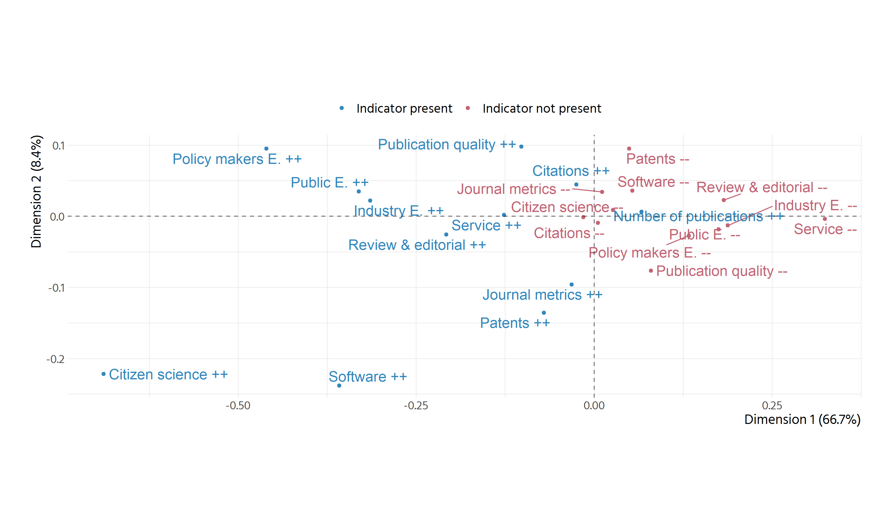
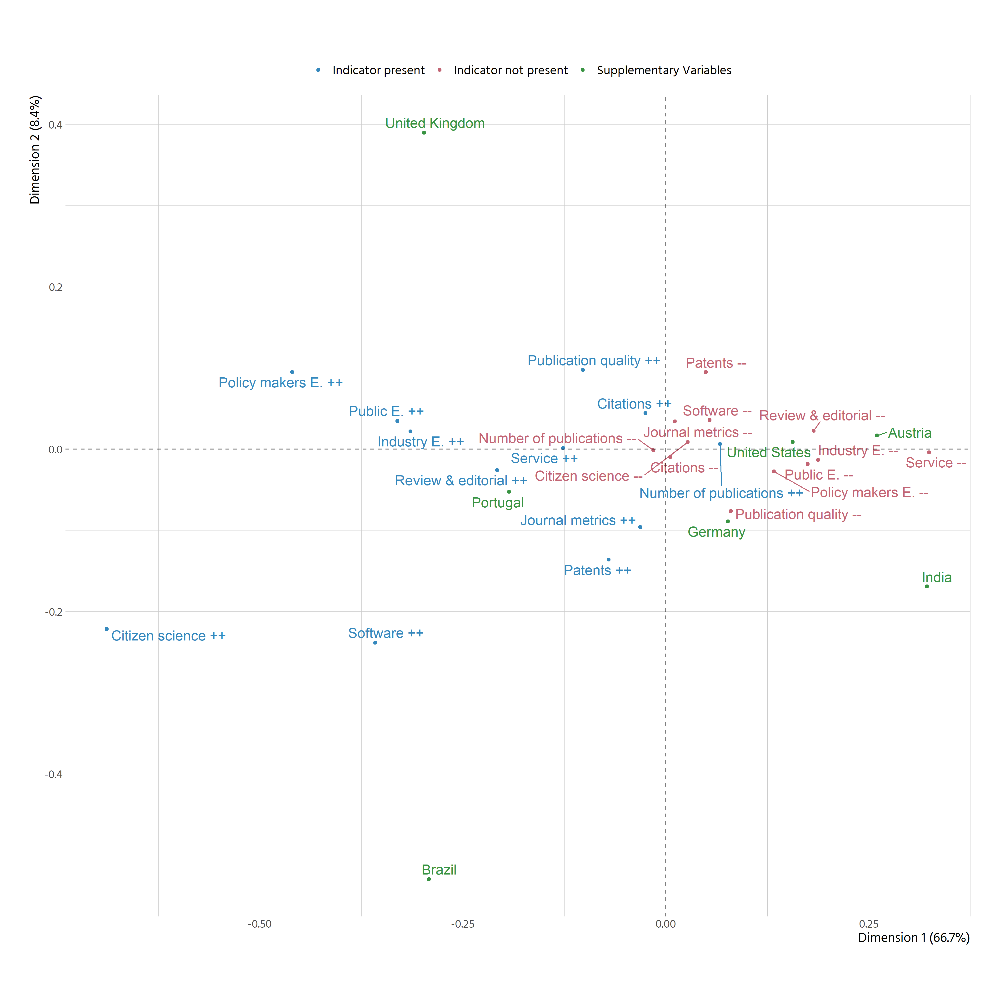
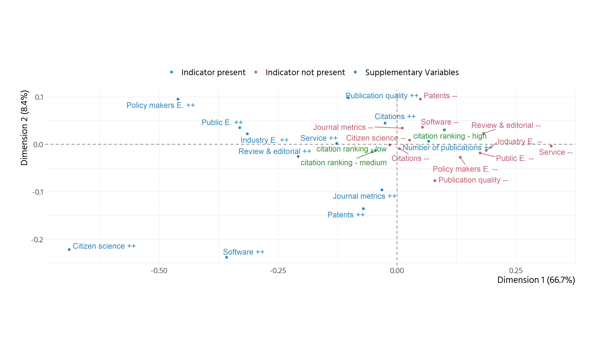
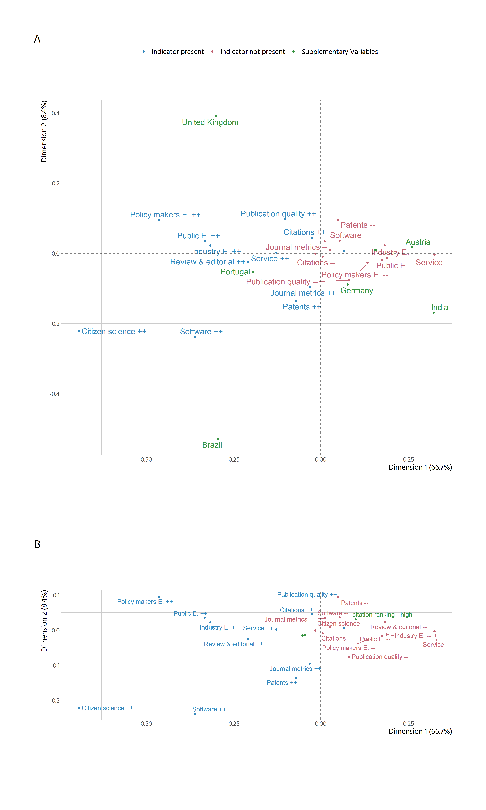

```
## `summarise()` has grouped output by 'country', 'university', 'code_legible', 'level'. You can override using the `.groups` argument.
```


```
## Scale for 'colour' is already present. Adding another scale for 'colour', which will replace the existing scale.
```

```
## Warning: ggrepel: 1 unlabeled data points (too many overlaps). Consider increasing max.overlaps
```

<!-- -->


# Model with countries


<!-- -->

This shows the patterns better than the previous attempts with correlations etc.

GB: more concerned with engagement beyond academia, as well as publication quality
PT is somewhat similar to UK, but with more focus on public engagement and less
on publication quality
BR is dominated by software and citizen science (both low frequency cells)
AT: low on engagement
DE, similar to austria, but more on patents and peer review
India is low on everything, in comparative terms, lower on impact and service
USA is closest to the average (also being the biggest), below average in impact,
but generally below average in all aspects

Important: GB, PT and BR look very far apart, but this is due to second axis. On 
first axis, they are very similar (in terms of service and or impact). Different
in terms of patents and publication quality.

Important to also consider the table

```
## 
## Principal inertias (eigenvalues):
## 
##  dim    value      %   cum%   scree plot               
##  1      0.025643  66.7  66.7  *********************    
##  2      0.003221   8.4  75.0  ***                      
##  3      0.001211   3.1  78.2  *                        
##  4      9.6e-050   0.2  78.4                           
##         -------- -----                                 
##  Total: 0.038469                                       
## 
## 
## Columns:
##                                                  name   mass  qlt  inr    k=1 cor  ctr    k=2 cor  ctr  
## 1  |                           Citations:Citations -- |   69   36   12 |    5   9    0 |  -10  27    2 |
## 2  |                           Citations:Citations ++ |   15   36   56 |  -25   9    0 |   44  27    9 |
## 3  |               Citizen.science:Citizen science -- |   80  825    3 |   27 747    2 |    9  77    2 |
## 4  |               Citizen.science:Citizen science ++ |    3  825   72 | -689 747   58 | -222  77   48 |
## 5  |                       Industry.E.:Industry E. -- |   52  818   39 |  188 814   72 |  -13   4    3 |
## 6  |                       Industry.E.:Industry E. ++ |   31  818   66 | -314 814  120 |   22   4    5 |
## 7  |             Policy.makers.E.:Policy makers E. -- |   65  798   25 |  133 765   45 |  -27  33   15 |
## 8  |             Policy.makers.E.:Policy makers E. ++ |   19  798   85 | -460 765  154 |   95  33   52 |
## 9  |                           Public.E.:Public E. -- |   55  803   36 |  175 795   65 |  -18   9    6 |
## 10 |                           Public.E.:Public E. ++ |   29  803   69 | -331 795  123 |   35   9   11 |
## 11 |               Journal.metrics:Journal metrics -- |   62  250   18 |   11  24    0 |   34 226   22 |
## 12 |               Journal.metrics:Journal metrics ++ |   22  250   50 |  -32  24    1 |  -96 226   63 |
## 13 | Number.of.publications:Number of publications -- |   68  307   11 |  -15 305    1 |   -1   3    0 |
## 14 | Number.of.publications:Number of publications ++ |   16  307   49 |   67 305    3 |    6   3    0 |
## 15 |                               Patents:Patents -- |   49  611   31 |   49 129    5 |   95 482  137 |
## 16 |                               Patents:Patents ++ |   34  611   45 |  -70 129    7 | -136 482  196 |
## 17 |       Publication.quality:Publication quality -- |   47  677   32 |   80 354   12 |  -77 323   85 |
## 18 |       Publication.quality:Publication quality ++ |   37  677   41 | -102 354   15 |   98 323  108 |
## 19 |         Review...editorial:Review & editorial -- |   44  856   41 |  182 843   57 |   23  13    7 |
## 20 |         Review...editorial:Review & editorial ++ |   39  856   47 | -208 843   65 |  -26  13    8 |
## 21 |                               Service:Service -- |   23  876   64 |  324 876   96 |   -4   0    0 |
## 22 |                               Service:Service ++ |   60  876   25 | -126 876   37 |    2   0    0 |
## 23 |                             Software:Software -- |   72  758   11 |   54 525    8 |   36 233   29 |
## 24 |                             Software:Software ++ |   11  758   71 | -358 525   55 | -238 233  192 |
## 25 |                          (*)country_name:Austria | <NA>  360 <NA> |  260 358 <NA> |   17   1 <NA> |
## 26 |                           (*)country_name:Brazil | <NA>  930 <NA> | -292 217 <NA> | -530 713 <NA> |
## 27 |                          (*)country_name:Germany | <NA>  266 <NA> |   77 113 <NA> |  -89 153 <NA> |
## 28 |                            (*)country_name:India | <NA>  852 <NA> |  322 667 <NA> | -169 185 <NA> |
## 29 |                         (*)country_name:Portugal | <NA>  275 <NA> | -193 256 <NA> |  -53  19 <NA> |
## 30 |                   (*)country_name:United Kingdom | <NA>  975 <NA> | -298 359 <NA> |  390 616 <NA> |
## 31 |                    (*)country_name:United States | <NA>  729 <NA> |  156 726 <NA> |    9   2 <NA> |
```


```
## New names:
## * cor -> cor...6
## * ctr -> ctr...7
## * cor -> cor...9
## * ctr -> ctr...10
```


Table: Numerical output from MCA on countries

|Variable                  | mass| inertia|  k=1| correlation with dim 1| contribution to dim 1|  k=2| correlation with dim 2| contribution to dim 2|
|:-------------------------|----:|-------:|----:|----------------------:|---------------------:|----:|----------------------:|---------------------:|
|Citations --              |   69|      12|    5|                      9|                     0|  -10|                     27|                     2|
|Citations ++              |   15|      56|  -25|                      9|                     0|   44|                     27|                     9|
|Citizen science --        |   80|       3|   27|                    747|                     2|    9|                     77|                     2|
|Citizen science ++        |    3|      72| -689|                    747|                    58| -222|                     77|                    48|
|Industry E. --            |   52|      39|  188|                    814|                    72|  -13|                      4|                     3|
|Industry E. ++            |   31|      66| -314|                    814|                   120|   22|                      4|                     5|
|Policy makers E. --       |   65|      25|  133|                    765|                    45|  -27|                     33|                    15|
|Policy makers E. ++       |   19|      85| -460|                    765|                   154|   95|                     33|                    52|
|Public E. --              |   55|      36|  175|                    795|                    65|  -18|                      9|                     6|
|Public E. ++              |   29|      69| -331|                    795|                   123|   35|                      9|                    11|
|Journal metrics --        |   62|      18|   11|                     24|                     0|   34|                    226|                    22|
|Journal metrics ++        |   22|      50|  -32|                     24|                     1|  -96|                    226|                    63|
|Number of publications -- |   68|      11|  -15|                    305|                     1|   -1|                      3|                     0|
|Number of publications ++ |   16|      49|   67|                    305|                     3|    6|                      3|                     0|
|Patents --                |   49|      31|   49|                    129|                     5|   95|                    482|                   137|
|Patents ++                |   34|      45|  -70|                    129|                     7| -136|                    482|                   196|
|Publication quality --    |   47|      32|   80|                    354|                    12|  -77|                    323|                    85|
|Publication quality ++    |   37|      41| -102|                    354|                    15|   98|                    323|                   108|
|Review & editorial --     |   44|      41|  182|                    843|                    57|   23|                     13|                     7|
|Review & editorial ++     |   39|      47| -208|                    843|                    65|  -26|                     13|                     8|
|Service --                |   23|      64|  324|                    876|                    96|   -4|                      0|                     0|
|Service ++                |   60|      25| -126|                    876|                    37|    2|                      0|                     0|
|Software --               |   72|      11|   54|                    525|                     8|   36|                    233|                    29|
|Software ++               |   11|      71| -358|                    525|                    55| -238|                    233|                   192|
|Austria                   |   NA|      NA|  260|                    358|                    NA|   17|                      1|                    NA|
|Brazil                    |   NA|      NA| -292|                    217|                    NA| -530|                    713|                    NA|
|Germany                   |   NA|      NA|   77|                    113|                    NA|  -89|                    153|                    NA|
|India                     |   NA|      NA|  322|                    667|                    NA| -169|                    185|                    NA|
|Portugal                  |   NA|      NA| -193|                    256|                    NA|  -53|                     19|                    NA|
|United Kingdom            |   NA|      NA| -298|                    359|                    NA|  390|                    616|                    NA|
|United States             |   NA|      NA|  156|                    726|                    NA|    9|                      2|                    NA|


# project also rankings

```
## # A tibble: 21 x 3
## # Groups:   country [7]
##    country citation_group                n
##    <chr>   <chr>                     <int>
##  1 AT      citation ranking - high       2
##  2 AT      citation ranking - low        2
##  3 AT      citation ranking - medium     2
##  4 BR      citation ranking - high       4
##  5 BR      citation ranking - low        4
##  6 BR      citation ranking - medium     4
##  7 DE      citation ranking - high       4
##  8 DE      citation ranking - low        4
##  9 DE      citation ranking - medium     4
## 10 GB      citation ranking - high       8
## # ... with 11 more rows
```

```
## # A tibble: 21 x 3
## # Groups:   country [7]
##    country research_group                n
##    <chr>   <chr>                     <int>
##  1 AT      research ranking - high       2
##  2 AT      research ranking - low        2
##  3 AT      research ranking - medium     2
##  4 BR      research ranking - high       4
##  5 BR      research ranking - low        4
##  6 BR      research ranking - medium     4
##  7 DE      research ranking - high       4
##  8 DE      research ranking - low        4
##  9 DE      research ranking - medium     4
## 10 GB      research ranking - high       8
## # ... with 11 more rows
```


```
## Joining, by = c("country", "university")
```


```
## Warning: ggrepel: 1 unlabeled data points (too many overlaps). Consider increasing max.overlaps
```

<!-- -->


```
## 
## Principal inertias (eigenvalues):
## 
##  dim    value      %   cum%   scree plot               
##  1      0.025643  66.7  66.7  *********************    
##  2      0.003221   8.4  75.0  ***                      
##  3      0.001211   3.1  78.2  *                        
##  4      9.6e-050   0.2  78.4                           
##         -------- -----                                 
##  Total: 0.038469                                       
## 
## 
## Columns:
##                                                  name   mass  qlt  inr    k=1 cor  ctr    k=2 cor  ctr  
## 1  |                           Citations:Citations -- |   69   36   12 |    5   9    0 |  -10  27    2 |
## 2  |                           Citations:Citations ++ |   15   36   56 |  -25   9    0 |   44  27    9 |
## 3  |               Citizen.science:Citizen science -- |   80  825    3 |   27 747    2 |    9  77    2 |
## 4  |               Citizen.science:Citizen science ++ |    3  825   72 | -689 747   58 | -222  77   48 |
## 5  |                       Industry.E.:Industry E. -- |   52  818   39 |  188 814   72 |  -13   4    3 |
## 6  |                       Industry.E.:Industry E. ++ |   31  818   66 | -314 814  120 |   22   4    5 |
## 7  |             Policy.makers.E.:Policy makers E. -- |   65  798   25 |  133 765   45 |  -27  33   15 |
## 8  |             Policy.makers.E.:Policy makers E. ++ |   19  798   85 | -460 765  154 |   95  33   52 |
## 9  |                           Public.E.:Public E. -- |   55  803   36 |  175 795   65 |  -18   9    6 |
## 10 |                           Public.E.:Public E. ++ |   29  803   69 | -331 795  123 |   35   9   11 |
## 11 |               Journal.metrics:Journal metrics -- |   62  250   18 |   11  24    0 |   34 226   22 |
## 12 |               Journal.metrics:Journal metrics ++ |   22  250   50 |  -32  24    1 |  -96 226   63 |
## 13 | Number.of.publications:Number of publications -- |   68  307   11 |  -15 305    1 |   -1   3    0 |
## 14 | Number.of.publications:Number of publications ++ |   16  307   49 |   67 305    3 |    6   3    0 |
## 15 |                               Patents:Patents -- |   49  611   31 |   49 129    5 |   95 482  137 |
## 16 |                               Patents:Patents ++ |   34  611   45 |  -70 129    7 | -136 482  196 |
## 17 |       Publication.quality:Publication quality -- |   47  677   32 |   80 354   12 |  -77 323   85 |
## 18 |       Publication.quality:Publication quality ++ |   37  677   41 | -102 354   15 |   98 323  108 |
## 19 |         Review...editorial:Review & editorial -- |   44  856   41 |  182 843   57 |   23  13    7 |
## 20 |         Review...editorial:Review & editorial ++ |   39  856   47 | -208 843   65 |  -26  13    8 |
## 21 |                               Service:Service -- |   23  876   64 |  324 876   96 |   -4   0    0 |
## 22 |                               Service:Service ++ |   60  876   25 | -126 876   37 |    2   0    0 |
## 23 |                             Software:Software -- |   72  758   11 |   54 525    8 |   36 233   29 |
## 24 |                             Software:Software ++ |   11  758   71 | -358 525   55 | -238 233  192 |
## 25 |        (*)citation_group:citation ranking - high | <NA>  685 <NA> |  100 627 <NA> |   30  58 <NA> |
## 26 |         (*)citation_group:citation ranking - low | <NA>  996 <NA> |  -45 916 <NA> |  -13  81 <NA> |
## 27 |      (*)citation_group:citation ranking - medium | <NA>  392 <NA> |  -52 358 <NA> |  -16  34 <NA> |
```

```
## New names:
## * cor -> cor...6
## * ctr -> ctr...7
## * cor -> cor...9
## * ctr -> ctr...10
```


Table: Numerical output from MCA on rankings

|Variable                  | mass| inertia|  k=1| correlation with dim 1| contribution to dim 1|  k=2| correlation with dim 2| contribution to dim 2|
|:-------------------------|----:|-------:|----:|----------------------:|---------------------:|----:|----------------------:|---------------------:|
|Citations --              |   69|      12|    5|                      9|                     0|  -10|                     27|                     2|
|Citations ++              |   15|      56|  -25|                      9|                     0|   44|                     27|                     9|
|Citizen science --        |   80|       3|   27|                    747|                     2|    9|                     77|                     2|
|Citizen science ++        |    3|      72| -689|                    747|                    58| -222|                     77|                    48|
|Industry E. --            |   52|      39|  188|                    814|                    72|  -13|                      4|                     3|
|Industry E. ++            |   31|      66| -314|                    814|                   120|   22|                      4|                     5|
|Policy makers E. --       |   65|      25|  133|                    765|                    45|  -27|                     33|                    15|
|Policy makers E. ++       |   19|      85| -460|                    765|                   154|   95|                     33|                    52|
|Public E. --              |   55|      36|  175|                    795|                    65|  -18|                      9|                     6|
|Public E. ++              |   29|      69| -331|                    795|                   123|   35|                      9|                    11|
|Journal metrics --        |   62|      18|   11|                     24|                     0|   34|                    226|                    22|
|Journal metrics ++        |   22|      50|  -32|                     24|                     1|  -96|                    226|                    63|
|Number of publications -- |   68|      11|  -15|                    305|                     1|   -1|                      3|                     0|
|Number of publications ++ |   16|      49|   67|                    305|                     3|    6|                      3|                     0|
|Patents --                |   49|      31|   49|                    129|                     5|   95|                    482|                   137|
|Patents ++                |   34|      45|  -70|                    129|                     7| -136|                    482|                   196|
|Publication quality --    |   47|      32|   80|                    354|                    12|  -77|                    323|                    85|
|Publication quality ++    |   37|      41| -102|                    354|                    15|   98|                    323|                   108|
|Review & editorial --     |   44|      41|  182|                    843|                    57|   23|                     13|                     7|
|Review & editorial ++     |   39|      47| -208|                    843|                    65|  -26|                     13|                     8|
|Service --                |   23|      64|  324|                    876|                    96|   -4|                      0|                     0|
|Service ++                |   60|      25| -126|                    876|                    37|    2|                      0|                     0|
|Software --               |   72|      11|   54|                    525|                     8|   36|                    233|                    29|
|Software ++               |   11|      71| -358|                    525|                    55| -238|                    233|                   192|
|citation ranking - high   |   NA|      NA|  100|                    627|                    NA|   30|                     58|                    NA|
|citation ranking - low    |   NA|      NA|  -45|                    916|                    NA|  -13|                     81|                    NA|
|citation ranking - medium |   NA|      NA|  -52|                    358|                    NA|  -16|                     34|                    NA|


# combine them

```
## Warning: ggrepel: 5 unlabeled data points (too many overlaps). Consider increasing max.overlaps
```

```
## Warning: ggrepel: 4 unlabeled data points (too many overlaps). Consider increasing max.overlaps
```

<!-- -->

