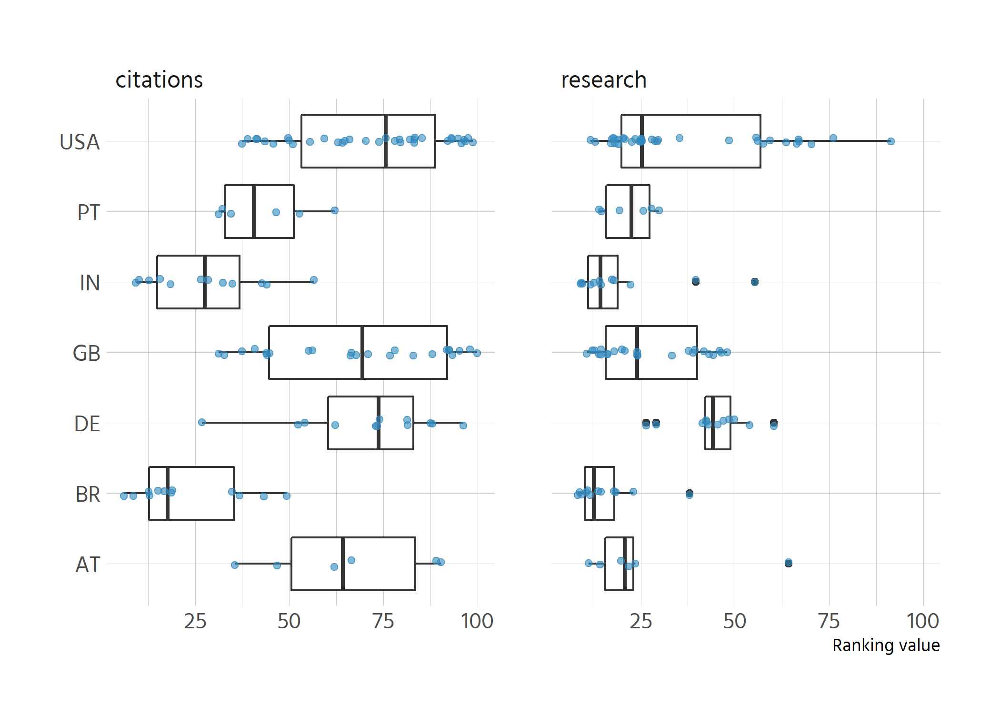

# Relationship pub quality, citations, journal metrics
What are the propensities for universities mentioning pub quality also mentioning
citations and jourmal metrics?


```
## `summarise()` has grouped output by 'country', 'university'. You can override using the `.groups` argument.
```

```
## # A tibble: 107 x 5
##    country university Citations `Journal metrics` `Publication quality`
##    <chr>        <dbl> <lgl>     <lgl>             <lgl>                
##  1 AT               1 FALSE     TRUE              TRUE                 
##  2 AT               2 FALSE     FALSE             TRUE                 
##  3 AT               3 FALSE     TRUE              FALSE                
##  4 AT               4 FALSE     TRUE              FALSE                
##  5 AT               5 FALSE     FALSE             FALSE                
##  6 AT               6 TRUE      FALSE             FALSE                
##  7 BR               1 FALSE     FALSE             FALSE                
##  8 BR               2 FALSE     FALSE             FALSE                
##  9 BR               3 FALSE     TRUE              FALSE                
## 10 BR               4 FALSE     TRUE              FALSE                
## # ... with 97 more rows
```


```
##  Publication quality FALSE  TRUE  Total
##                FALSE 90.0% 10.0% 100.0%
##                 TRUE 72.3% 27.7% 100.0%
```


```
##  Publication quality FALSE  TRUE  Total
##                FALSE 73.3% 26.7% 100.0%
##                 TRUE 74.5% 25.5% 100.0%
```

```
##  Citations FALSE  TRUE  Total
##      FALSE 78.4% 21.6% 100.0%
##       TRUE 52.6% 47.4% 100.0%
```


<!-- -->
